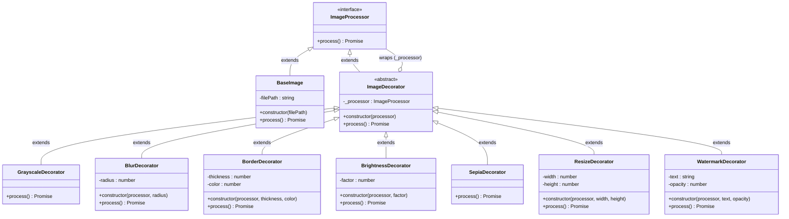

# Lab 3 — Decorator Design Pattern
## PixelWrap: Image Processing Pipeline

**Course:** Software Engineering  
**Pattern:** Decorator (GOF Structural)  
**Project:** PixelWrap  
**Stack:** Node.js + Jimp  
**Repository:** https://github.com/Aadritaaa/pixel-wrap

---

## 1. Pattern Name

**Decorator Pattern**

Also known as: *Wrapper*

---

## 2. Category

**Structural** — GOF (Gang of Four) Design Pattern

Structural patterns are concerned with how classes and objects are composed to form larger structures. The Decorator pattern achieves this by wrapping objects in layers of behaviour rather than hardcoding it through inheritance.

---

## 3. Intent

Attach additional responsibilities to an object **dynamically**, at runtime, without modifying that object's class. Decorators provide a flexible alternative to subclassing for extending functionality.

> *"Attach additional responsibilities to an object dynamically. Decorators provide a flexible alternative to subclassing for extending functionality."*
> — GoF, Design Patterns (1994)

The key word is **dynamically**: unlike inheritance (which is fixed at compile time), decorators are composed at runtime and can be stacked in any order and combination.

---

## 4. Problem Statement

In image processing applications, it is common to apply multiple effects to an image — grayscale conversion, blur, colour correction, border, watermark, resize, and so on. The straightforward approach is to hard-code each combination as a separate class:

```
ImageWithBlur
ImageWithGrayscale
ImageWithBlurAndGrayscale
ImageWithBlurAndGrayscaleAndBorder
ImageWithBorderAndWatermark
...
```

With **N** possible effects, the number of subclasses needed to cover every combination is **2ⁿ**, which grows explosively. This is called **subclass explosion** and violates the Single Responsibility Principle because every combination class must duplicate logic across multiple concerns.

**PixelWrap's problem:** How can we support arbitrary combinations of 7 image effects (grayscale, blur, border, brightness, sepia, resize, watermark) — including user-defined order — without writing 2⁷ = 128 subclasses?

---

## 5. Motivation — Inheritance vs. Decoration

### Naive Approach: Subclass Explosion

Suppose we only have three effects. A pure-inheritance solution requires:

```
BaseImage (no effect)
├── GrayscaleImage
├── BlurImage
├── BorderImage
├── GrayscaleBlurImage
├── GrayscaleBorderImage
├── BlurBorderImage
└── GrayscaleBlurBorderImage   ← 7 classes for 3 effects
```

With 7 effects this becomes **128 classes**. Each combination duplicates logic, any change to one effect ripples through all classes that include it, and adding an 8th effect doubles the count again.

### Decorator Approach: Composable Wrappers

The Decorator pattern solves this by creating one small class per effect and *wrapping* them around the base object at runtime:

```javascript
// Equivalent to GrayscaleBlurBorderImage, built at runtime
const pipeline = new BorderDecorator(
  new BlurDecorator(
    new GrayscaleDecorator(
      new BaseImage('photo.jpg')
    )
  )
);
```

- **N classes total** (not 2ⁿ)
- Effects compose in any order
- Adding a new effect = adding one class only
- No existing class is modified

---

## 6. Pattern Structure

The diagram below reflects the **actual classes** in the PixelWrap codebase.



**Key relationships:**
- `BaseImage` extends `ImageProcessor` (Concrete Component)
- `ImageDecorator` extends `ImageProcessor` (satisfies the Component interface)
- `ImageDecorator` holds a `_processor` reference back to `ImageProcessor` (the wrapped object — this is the decoration link)
- Every concrete decorator extends `ImageDecorator` and calls `super.process()` to delegate before applying its own transformation

---

## 7. Class Responsibilities

### `ImageProcessor` — [`src/ImageProcessor.js`](../src/ImageProcessor.js)

`ImageProcessor` is the **Component interface** at the root of the pattern hierarchy. It declares the single method `process()`, which all participants must implement. By programming to this interface rather than any concrete class, the pattern ensures that decorators and concrete components are interchangeable — the CLI, `pipelineBuilder`, and `ImageDecorator` all depend only on this abstraction.

### `BaseImage` — [`src/BaseImage.js`](../src/BaseImage.js)

`BaseImage` is the **Concrete Component** — the object that gets decorated. Its sole responsibility is to load a JPEG/PNG file from disk using `Jimp.read(filePath)` and return the raw `Jimp` image instance unchanged. It performs no visual transformation and represents the "clean slate" that all decorators operate on.

### `ImageDecorator` — [`src/ImageDecorator.js`](../src/ImageDecorator.js)

`ImageDecorator` is the **Abstract Decorator**. It extends `ImageProcessor` (satisfying the interface) and stores a reference to any other `ImageProcessor` in `this._processor`. Its `process()` implementation delegates directly to `this._processor.process()`, establishing the chain. All concrete decorators extend this class; they override `process()`, call `super.process()` to get the current image, apply their transformation, then return it.

### `GrayscaleDecorator` — [`src/decorators/GrayscaleDecorator.js`](../src/decorators/GrayscaleDecorator.js)

Converts the image to grayscale by calling Jimp's `greyscale()` method on the image returned by the wrapped processor. It has no configuration parameters — the effect is binary.

### `BlurDecorator` — [`src/decorators/BlurDecorator.js`](../src/decorators/BlurDecorator.js)

Applies a Gaussian blur with a configurable `radius` parameter (default: 4 pixels). The `radius` is stored as instance state in the decorator, illustrating how decorators can carry their own configuration independently of other layers in the chain.

### `BorderDecorator` — [`src/decorators/BorderDecorator.js`](../src/decorators/BorderDecorator.js)

Adds a solid-colour border by creating a new, larger Jimp canvas filled with the border colour, then compositing the decorated image onto it centred at offset `(thickness, thickness)`. This is the only decorator that changes the image's physical dimensions.

### `BrightnessDecorator` — [`src/decorators/BrightnessDecorator.js`](../src/decorators/BrightnessDecorator.js)

Adjusts overall image brightness by a `factor` in the range `[-1, 1]`. Negative values darken the image; positive values lighten it. Uses Jimp's `brightness()` method directly on the pixel data.

### `SepiaDecorator` — [`src/decorators/SepiaDecorator.js`](../src/decorators/SepiaDecorator.js)

Applies a classic sepia tone filter via Jimp's `sepia()` method, which shifts RGB values according to the standard sepia matrix to produce a warm, vintage photograph look. It is the simplest concrete decorator — no configurable parameters, no state beyond the wrapped processor.

### `ResizeDecorator` — [`src/decorators/ResizeDecorator.js`](../src/decorators/ResizeDecorator.js)

Resizes the image to a target width and/or height. If only one dimension is provided (the other is `-1`), the decorator calculates the complementary dimension to preserve the original aspect ratio using simple proportional arithmetic. Uses Jimp's `resize({ w, h })` method.

### `WatermarkDecorator` — [`src/decorators/WatermarkDecorator.js`](../src/decorators/WatermarkDecorator.js)

Overlays a semi-transparent white rectangle at the bottom of the image — a font-free watermark implementation that works without external bitmap font assets. It uses pixel-level blending: for each pixel in the strip, it reads the existing RGBA value and linearly interpolates it toward white at the configured `opacity` level using the top-level `intToRGBA` / `rgbaToInt` exports from Jimp v1.

### `pipelineBuilder` — [`src/pipelineBuilder.js`](../src/pipelineBuilder.js)

Not a GOF participant itself, but a **registry-pattern** builder that constructs the decorator chain from a plain config array. The `EFFECT_REGISTRY` object maps effect name strings to factory functions. The `buildPipeline()` function uses `Array.reduce()` to thread the base processor through each factory in sequence, producing the fully nested decorator chain. Adding a new effect requires only a new entry in `EFFECT_REGISTRY` — no other file changes.

### `cli.js` — [`cli.js`](../cli.js)

The entry point. Parses `--input`, `--output`, and `--effects` flags from `process.argv`, converts the comma-separated effect list into a config array, calls `buildPipeline()`, awaits `pipeline.process()`, and writes the result via `result.write(outputPath)`.

---

## 8. Code Implementation

### Step 1 — Define the Component Interface

`src/ImageProcessor.js` declares the `process()` contract. Any object that has a `process()` method returning a `Promise<JimpImage>` is a valid participant:

```javascript
class ImageProcessor {
  async process() {
    throw new Error(`${this.constructor.name} must implement process()`);
  }
}
```

The base implementation throws, so forgetting to override in a subclass is caught immediately at runtime.

### Step 2 — Implement the Concrete Component

`src/BaseImage.js` extends `ImageProcessor` and loads the source file:

```javascript
class BaseImage extends ImageProcessor {
  constructor(filePath) {
    super();
    this.filePath = filePath;
  }
  async process() {
    const image = await Jimp.read(this.filePath);
    return image;
  }
}
```

Calling `new BaseImage('photo.jpg').process()` returns the raw Jimp image object. No effects applied.

### Step 3 — Implement the Abstract Decorator

`src/ImageDecorator.js` stores the wrapped processor and delegates `process()` to it:

```javascript
class ImageDecorator extends ImageProcessor {
  constructor(processor) {
    super();
    this._processor = processor;  // the wrapped object
  }
  async process() {
    return this._processor.process();  // pure delegation
  }
}
```

The runtime type-check (`instanceof ImageProcessor`) in the constructor prevents invalid wrapping.

### Step 4 — Implement Concrete Decorators

Each decorator follows the same three-step pattern:

```javascript
class BlurDecorator extends ImageDecorator {
  constructor(processor, radius = 4) {
    super(processor);          // 1. pass wrapped processor to parent
    this.radius = radius;      //    store own config
  }
  async process() {
    const image = await super.process();  // 2. delegate upward, get image
    image.blur(this.radius);              // 3. apply own transformation
    return image;                         //    return modified image
  }
}
```

This three-step structure (`super(processor)` → `super.process()` → apply → return) is identical across all seven concrete decorators.

### Step 5 — Build the Chain with `pipelineBuilder`

`src/pipelineBuilder.js` uses `Array.reduce()` to thread the base processor through each factory:

```javascript
function buildPipeline(baseProcessor, effectsConfig) {
  return effectsConfig.reduce((processor, { name, options = {} }) => {
    const factory = EFFECT_REGISTRY[name];
    return factory(processor, options);
  }, baseProcessor);
}
```

For `--effects blur,grayscale,border` this produces:

```
BorderDecorator(
  GrayscaleDecorator(
    BlurDecorator(
      BaseImage('photo.jpg')
    )
  )
)
```

### Step 6 — CLI wires it all together

`cli.js` parses arguments, calls `buildPipeline()`, then calls `pipeline.process()` and writes the result:

```javascript
const base     = new BaseImage(path.resolve(inputPath));
const pipeline = buildPipeline(base, effectsConfig);
const result   = await pipeline.process();
await result.write(outputPath);
```

---

## 9. Execution Flow

**Command:**
```bash
node cli.js --input photo.jpg --output out.jpg --effects blur,grayscale,border
```

**Object construction phase** (synchronous):

```
cli.js
  → new BaseImage('photo.jpg')            [Concrete Component created]
  → buildPipeline(base, [{blur},{grayscale},{border}])
      iteration 1: new BlurDecorator(base, 4)
      iteration 2: new GrayscaleDecorator(blurDec)
      iteration 3: new BorderDecorator(grayDec, 20, 0x000000ff)
  → returns: borderDec                    [outermost decorator]
```

**`pipeline.process()` call** (asynchronous, unwraps inward then re-wraps outward):

```
borderDec.process()
  → super.process()  [delegates to grayDec]
      → super.process()  [delegates to blurDec]
          → super.process()  [delegates to base]
              → Jimp.read('photo.jpg')   ← I/O happens here
              ← returns raw JimpImage
          ← blurDec applies image.blur(4)
          ← returns blurred JimpImage
      ← grayDec applies image.greyscale()
      ← returns grayscale+blurred JimpImage
  ← borderDec creates new canvas, composites image at (20,20)
  ← returns bordered+grayscale+blurred JimpImage

result.write('out.jpg')   ← final I/O
```

The call chain **unwinds inward** to the data source, then **rewinds outward** applying each decoration in the order they wrap (left-to-right in the `--effects` list means innermost-to-outermost in nesting, which means first-applied to last-applied).

---

## 10. Advantages

**Specific to PixelWrap:**

1. **Runtime composition** — The CLI accepts any comma-separated list of effects at runtime. No recompilation or code change needed to add `sepia,blur,watermark` instead of `grayscale,border`.

2. **N classes, not 2ⁿ** — 7 effect classes cover all 5,040 orderings of 7 effects (plus any subset). Without the Decorator pattern, covering all combinations would require hundreds of classes.

3. **Open/Closed Principle** — The `EFFECT_REGISTRY` in `pipelineBuilder.js` means adding an 8th effect (e.g., `sharpen`) requires writing exactly one new file (`SharpenDecorator.js`) and adding one line to the registry. No existing class is touched.

4. **Single Responsibility** — Each decorator is responsible for exactly one visual transformation. `BorderDecorator` knows nothing about blur; `GrayscaleDecorator` knows nothing about watermarks.

5. **Independent configurability** — Each decorator stores its own parameters (`radius`, `thickness`, `opacity`, etc.) as instance fields, so two `BlurDecorator` instances with different radii can coexist in the same pipeline.

6. **Transparent to callers** — `cli.js` and `pipelineBuilder.js` only ever call `.process()` on an `ImageProcessor`. They cannot tell whether they're talking to a `BaseImage` or a chain of 7 decorators.

---

## 11. Limitations

1. **Order-sensitivity** — `blur → grayscale` and `grayscale → blur` produce visually different results. The Decorator pattern makes no claim about ordering; the user (or CLI caller) must understand the semantics of the effects they chain.

2. **Wrapping overhead** — Each decorator adds one function call frame to the async call stack. For a 7-effect pipeline, `process()` is called 8 times (once per decorator + once for `BaseImage`). For typical image sizes this is negligible, but deeply nested chains on very large images accumulate async promise overhead.

3. **No global state** — Because each decorator only sees the image returned by the layer below it, there is no mechanism for a decorator to introspect the full chain (e.g., "if a grayscale decorator is already in the chain, skip this step"). Cross-decorator communication is not natively supported.

4. **Debugging complexity** — A stack trace through a 7-deep decorator chain can be harder to read than a flat method call. The call stack shows `process → process → process → ...` with no immediate indication of which class corresponds to which level.

5. **Not reversible** — Once `process()` runs, the decorators have been applied in sequence and the result is a flat Jimp image. There is no undo mechanism within the pattern itself.

---

## 12. Real-life Applications

| Domain | Decorator Use |
|---|---|
| **I/O Streams** | Java's `BufferedReader(new FileReader(...))` wraps file I/O with buffering — the canonical textbook example |
| **Web Middleware** | Express.js / Koa middleware chains: each middleware wraps the `(req, res, next)` handler with logging, auth, compression |
| **GUI Frameworks** | Swing's `JScrollPane(new JTextArea())` adds scroll behaviour to any component |
| **Logging** | Wrapping a logger with timed-logging, coloured-output, or file-output decorators |
| **HTTP clients** | Wrapping a base HTTP client with retry, caching, authentication, and timeout decorators |
| **Image editing** | Photoshop/GIMP non-destructive adjustment layers are a conceptual equivalent |
| **Compression** | `GZIPOutputStream(new BufferedOutputStream(new FileOutputStream(...)))` |

---

## 13. Industry Examples

**Java I/O (JDK)** — The `java.io` package has been using the Decorator pattern since Java 1.0. `InputStream` is the component interface; `FileInputStream` is the concrete component; `FilterInputStream` is the abstract decorator; `BufferedInputStream`, `DataInputStream`, `GZIPInputStream` are concrete decorators.

**Python `functools` / decorators** — Python's `@` decorator syntax is the language-level embodiment of the Decorator pattern. Libraries like Flask use `@app.route('/path')` and `@login_required` to stack behaviours onto view functions at definition time.

**React Higher-Order Components (HOCs)** — `withAuth(withLogger(MyComponent))` applies the GOF Decorator pattern to React components: each HOC wraps a component with additional props or behaviour without modifying the original.

**Node.js Express middleware** — `app.use(cors())`, `app.use(compression())`, `app.use(morgan('dev'))` stack middleware decorators onto the request handler, each one wrapping the next.

**AWS Lambda Powertools** — The `@logger`, `@tracer`, `@metrics` decorators in Python/TypeScript Powertools wrap Lambda handler functions with observability logic, a direct application of the pattern.

---

## 14. Demonstration

The following is **real, unedited terminal output** captured during this session (2026-09-25):

```
$ node cli.js --input sample_images/test.jpg --output output/test_session2.jpg --effects blur,grayscale,border

PixelWrap Image Processor
==========================
Input:   sample_images/test.jpg
Output:  output/test_session2.jpg
Effects: blur -> grayscale -> border

Processing pipeline...

Done! Output saved to: output/test_session2.jpg
```

**Pipeline constructed (internally):**

```
BorderDecorator(
  GrayscaleDecorator(
    BlurDecorator(
      BaseImage('D:\pixel-wrap\sample_images\test.jpg')
    )
  )
)
```

**Execution order of transformations:**

1. `BaseImage.process()` — loads `test.jpg` (400×300, synthetic colour-band image) from disk
2. `BlurDecorator.process()` — applies Gaussian blur, radius=4
3. `GrayscaleDecorator.process()` — converts blurred image to grayscale
4. `BorderDecorator.process()` — expands canvas to 440×340, composites grayscale image centred at (20,20)

**Output file:** `output/test_session2.jpg` — written successfully.

**Previous session verification** (2026-09-24):

```
$ node cli.js --input sample_images/test.jpg --output output/result1.jpg --effects grayscale,blur,border
→ Done! Output saved to: output/result1.jpg  (16,320 bytes)

$ node cli.js --input sample_images/test.jpg --output output/result2.jpg --effects sepia,brightness,watermark
→ Done! Output saved to: output/result2.jpg  (12,001 bytes)
```

All three runs produced valid JPEG files with no errors.

---

## 15. Conclusion

The Decorator pattern solves PixelWrap's core engineering challenge — supporting flexible, composable image effect pipelines — in a way that is both theoretically sound and practically elegant. By establishing `ImageProcessor` as the uniform interface, `BaseImage` as the data source, and `ImageDecorator` as the wrapping mechanism, the pattern enables:

- **Runtime flexibility**: any combination and order of effects via a single CLI flag
- **Linear scalability**: 7 classes cover all combinations without subclass explosion
- **Open extensibility**: new effects slot in without touching existing code
- **Clear separation of concerns**: each class does exactly one thing

The `pipelineBuilder.js` registry further reinforces the pattern's extensibility by decoupling effect selection from effect implementation. PixelWrap demonstrates that the Decorator pattern is not merely a textbook abstraction but a practical, production-applicable design choice for any system where behaviours need to be combined dynamically.
